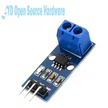
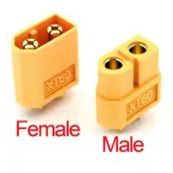

# Microcontrolador: ESP32 com Wi-Fi

  

> Motivo: oferece dois ADCs de 12 bits para amostragem simultânea, além de comunicação sem-fio nativa (Wi-Fi/Bluetooth) para interface móvel e envio de dados em tempo real. Sua performance (dual-core, até 240 MHz) garante resposta rápida às interrupções e ao controle do sistema.

# Sensor de tensão (divisor resistivo para até 25 V)

 

> Motivo: um divisor resistivo simples é preciso e econômico para reduzir a tensão de até 25 V ao intervalo seguro (0–3,3 V) dos ADCs do ESP32, permitindo leitura direta e linear da tensão de alimentação da impressora.

# Sensor de corrente: ACS712 20 A

 

> Motivo: o ACS712 fornece isolamento galvânico e saída analógica proporcional à corrente (±20 A), compatível com o range esperado da impressora 3D. Conecta-se ao segundo ADC do ESP32, permitindo cálculo de potência instantânea sem circuitos de corrente contínua direta.

# Sensor de queda de tensão: comparador (amplificador operacional)

 

> Motivo: um comparador baseado em amp-op gera um sinal digital ao detectar subtensão abaixo de um limiar (por exemplo, <20 V), acionando o sistema para envio da informação que o houve queda de energia para o usuário.

# Interruptor de energia: Relé SRA-05VDC-CL

 

> Motivo: relé de 5 V DC com contato para até 20A em 24V DC, suficiente para a corrente da impressora. Tem fácil acionamento, garantindo isolamento entre potência e lógica.

# Bateria escolhida: Células 18650 Li-ion (reutilizadas de notebooks)

 

> Motivo: Alta densidade de energia, longa vida útil (500~1000 ciclos), elevada eficiência (≈ 95 %) e tensão ideal (6 S: 22,2V nominal; 25,2V carga) para sistema 24 V. Reuso de células usadas reduz custo e impacto ambiental, promovendo economia circular.

# BMS: Módulo S6 24 V 40 A para Li-íon

 

> Motivo: oferece proteção contra sobrecarga, subtensão, sobrecorrente e balanceamento de 6S de células 18650, suportando até 40 A de descarga máxima. Garante segurança e prolonga a vida útil do banco de baterias.

# Conectores XT60

 

> Motivo: padrão da Ender3 Creality e de muitas impressoras 3D, suportam correntes até 60 A e fornecem conexão robusta, polaridade garantida e baixa resistência de contato, facilitando integração direta com a impressora sem adaptadores.

# Cabos de saída: cabo elétrico flexível 2.5 mm

> Motivo: Visto que a potência de saída da fonte da impressora Ender 3 Creality é de 270W a 24V, o cabo foi calculado com base na corrente máxima suportada e colocado um fator de segurança de 2. 

