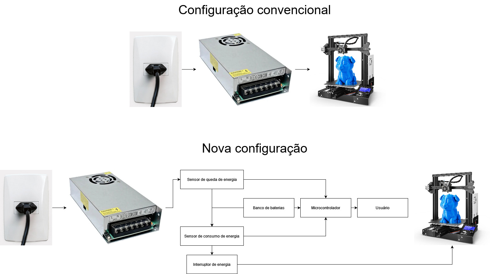

# Objetivos Gerais:

O produto consiste em funcionalidades distintas que servem para ajudar o usuário de
impressora 3D a ter mais confiabilidade e opções no processo de fazer as suas peças.

# Casos de Uso

Imagine as seguintes situações

> A rede elétrica da sua casa momentâneamente caiu, e você estava a imprimir uma  
> peça que demora horas para ficar pronta, e por causa desse queda acontece uma falha
> na sua querida impressão

> Você está trazendo a vida uma estátua que um cliente seu pediu, mas não sabe 
> exatamente como cobrar pois não entende o quanto gasta de energia com a impressora.

> Você coloca uma peça para ser impressa, e não pode ficar no mesmo hambiente 
> até a impressão acabar pois tem compromissos e, quano a impressão acaba, quer desligar 
> a impressora para não gastar energia durante esse tempo fora.

Se esses são alguns dos problemas que você se depara ao usar uma impressoras 3D, o nosso
produto é para você.

# Objetivos Específicos:

Previnir a falha de impressão decorrente de quedas rápidas de energia, evitar o gasto
desnecessário de enrgia ao término de uma impressão, informar ao usuário sobre o gasto 
energético da impressão, informar ao usuário de quedas e retornos de energia.

# Funcionalidades do produto:

- **Aguenta quedas de energia de 1 minutos sem prejudicar a impressão.**

- **Desliga a impressora após a impressão concluída.**

- **Calcula o gasto de energia para a impressão.**

- **Envia notificação de quanta quanta energia foi gasta em uma impressão.**

- **Envia notificação quando a energia cai.**  

- **Envia notificação quando a energia volta.**  

## Sistema

